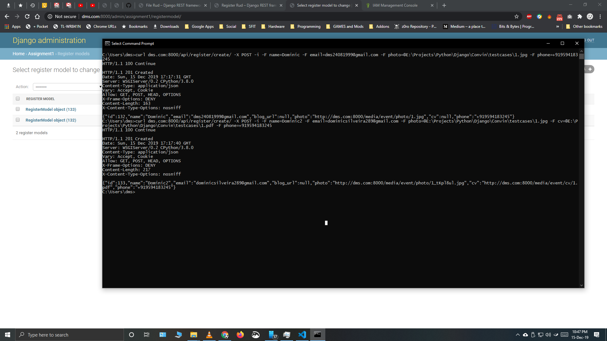
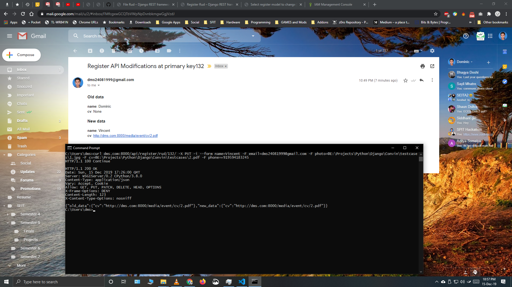
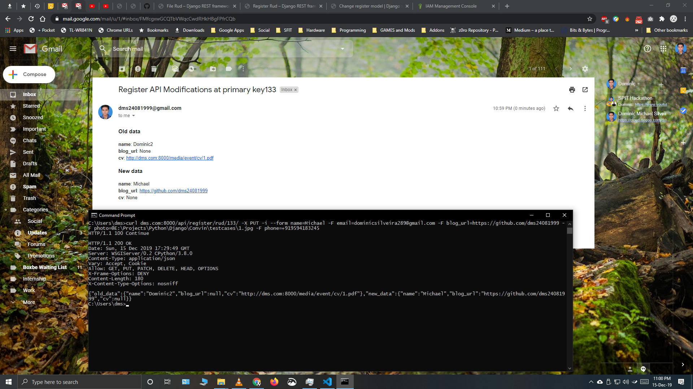
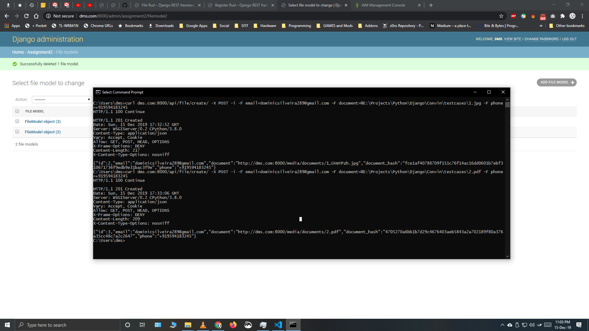
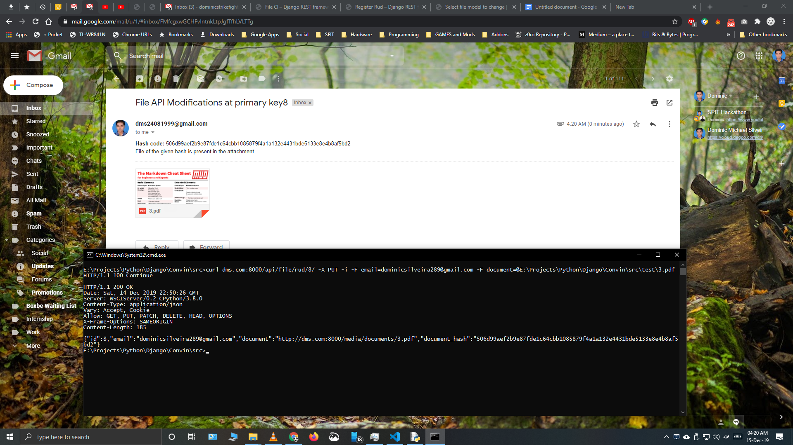
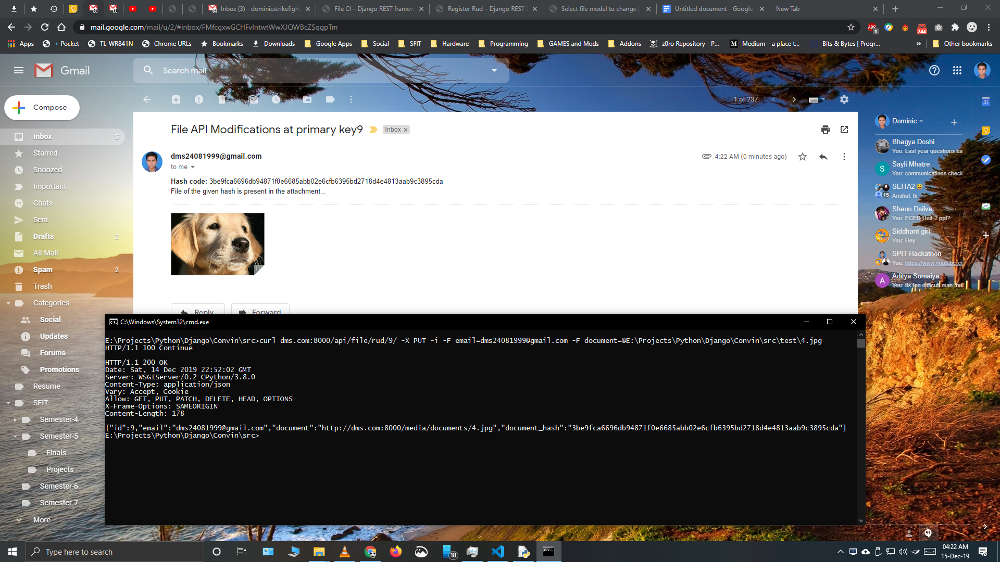

# Convin Assignment 
## Clone Repository
```
git clone https://github.com/dms24081999/Convin-Assignment.git
cd Convin-Assignment
```
***
## Install virtualenv
```
pip install virtualenv 
```
## Create virtual environment
```
virtualenv -p "path to python.exe (eg.: 'C:\Program Files\Python38\python.exe')" venv_name
```
## Activate virtual environment
```
venv_name\scripts\activate  
```
## Install requirements.txt
```
pip install -r requirements.txt 
```
***
## Create Super User (Optional)
```
cd src
python manage.py runserver
```
#### Default:
```
Username: dms
Password: 24081999
```
***
## Run Project
```
cd src
python manage.py runserver
```
***
## URL's in Project
#### Admin URL: ```admin/```
#### Create API URL for assignment-1 (Registration Form): ```api/register/create/```
#### Update API URL for assignment-1 with API and email, SMS notifications (Registration Form): ```api/register/rud/<pk>/```
#### Create API URL for assignment-2 (File hashing Form): ```api/file/create/```
#### Update API URL for assignment-1 with API and email, SMS notifications (File hashing Form): ```api/file/rud/<pk>/```
*** 

## Examples via curl
#### Q.1) Create a model having fields of type CharField and FileField. Implement a system on top of this model which should notify the updated/created field only and its old and new value. (it shouldn’t notify about the field which is not updated). It should also notify in case content of FileField is changed. [You may use signals or any other mechanism of your choice.]   

### Create/add data via API for assignment-1:
```
curl dms.com:8000/api/register/create/ -X POST -i -F name=Dominic -F email=dms24081999@gmail.com -F photo=@E:\Projects\Python\Django\Convin\testcases\1.jpg -F phone=+919594183245
```
```
curl dms.com:8000/api/register/create/ -X POST -i -F name=Dominic2 -F email=dominicsilveira289@gmail.com -F photo=@E:\Projects\Python\Django\Convin\testcases\1.jpg -F cv=@E:\Projects\Python\Django\Convin\testcases\1.pdf -F phone=+919594183245
```


### Update data via API and receive notifications vai API and email, SMS for assignment-1:
```
curl dms.com:8000/api/register/rud/132/ -X PUT -i --form name=Vincent -F email=dms24081999@gmail.com -F photo=@E:\Projects\Python\Django\Convin\testcases\1.jpg -F cv=@E:\Projects\Python\Django\Convin\testcases\2.pdf -F phone=+919594183245
```


```
curl dms.com:8000/api/register/rud/133/ -X PUT -i --form name=Michael -F email=dominicsilveira289@gmail.com -F blog_url=https://github.com/dms24081999 -F photo=@E:\Projects\Python\Django\Convin\testcases\1.jpg -F phone=+919594183245
```



#### Q.2) Now suppose CharField is the encrypted value of the content of FileFIeld (or you can choose any heavy computation of your choice on the content of File(it may be just along for loop)). Implement a system which allows updating FileField content by an external party (for example invoking management command from bash or calling a Django API or your choice of making it accessible by an external party). Note: after FileField content is changed, it should notify the updated value of FileField and CharField. 
### Create/add data via API for assignment-2:
```
curl dms.com:8000/api/file/create/ -X POST -i -F email=dominicsilveira289@gmail.com -F document=@E:\Projects\Python\Django\Convin\testcases\1.jpg -F phone=+919594183245
```
```
curl dms.com:8000/api/file/create/ -X POST -i -F email=dominicsilveira289@gmail.com -F document=@E:\Projects\Python\Django\Convin\testcases\2.pdf -F phone=+919594183245
```


### Update data via API and receive notifications vai API and email, SMS for assignment-2:
```
curl dms.com:8000/api/file/rud/2/ -X PUT -i -F email=dominicsilveira289@gmail.com -F document=@E:\Projects\Python\Django\Convin\testcases\3.pdf -F phone=+919594183245
```


```
curl dms.com:8000/api/file/rud/3/ -X PUT -i -F email=dms24081999@gmail.com -F document=@E:\Projects\Python\Django\Convin\testcases\4.jpg -F phone=+919594183245
```

